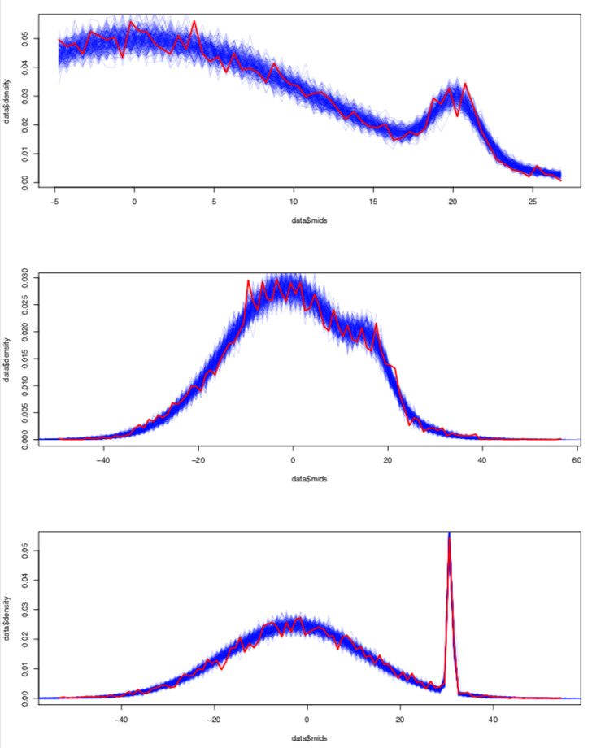

# My MCMC with R

I have written my own Metropolis Hastings algorithms (Markov chain Monte Carlo) to solve one common sicentific problem: model a multivariate mixing of truncated normal distributions. 

The problem is represented in the figure below. We have two populations that have normal distributions in a 3-dimensional space. 
However, the first dimension (top panel) is truncated on the left.
The thick red line represent the observed dataset. The thin blue lines are samples from the posteriors created by my algorithm.

